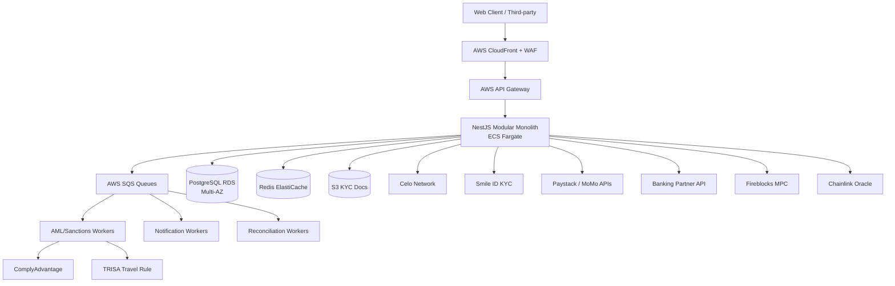

# System Architecture: Check12

**Date:** 2026-05-09
**Architect:** PromiseAlade
**Version:** 1.0
**Project Type:** Web Application
**Project Level:** 2 (Medium)
**Status:** Draft

---

## Document Overview

This document defines the system architecture for Check12, a regulated dual-stablecoin VASP platform. It provides the technical blueprint for implementation, addressing all 14 functional and 12 non-functional requirements from the PRD, incorporating 10 architectural recommendations for security, compliance, and resilience.

**Related Documents:**
- Product Requirements Document: `docs/prd-check12-2026-05-09.md`
- Product Brief: `docs/product-brief-check12-2026-05-09.md`

---

## Executive Summary

Check12 is built on a **Modular Monolith with an Event-Driven Compliance Layer**, deployed on AWS af-south-1 (Cape Town) for low latency to African users. The internal double-entry ledger is the source of truth for all balances — Celo blockchain provides periodic batch settlement for on-chain proof, not per-transaction latency. An async SQS-driven compliance pipeline screens every transaction for AML and sanctions without blocking user flows. MPC wallets protect stablecoin reserves. Tiered KYC accelerates onboarding while meeting Bank of Ghana requirements. All financial endpoints enforce idempotency. Circuit breakers isolate every external integration (mobile money, banking, KYC, Celo RPC).

---

## Architectural Drivers

These NFRs drive the most consequential design decisions:

1. **NFR-006 (Regulatory Compliance)** → Compliance-first design; no transaction bypasses KYC/AML gate; tiered KYC with transaction limits; FATF Travel Rule infrastructure; sanctions screening separate from AML
2. **NFR-007 (99.9% Uptime)** → Multi-AZ RDS, ECS Fargate with auto-scaling, no single points of failure, circuit breakers on all external integrations
3. **NFR-002 (30s On-platform Settlement)** → Internal ledger settles instantly; Celo batch settlement decoupled from user-facing flows
4. **NFR-008 (10K → 100K Concurrent Users)** → Stateless NestJS services on ECS Fargate, horizontal auto-scaling, Redis session store, RDS read replicas
5. **NFR-003/004/005 (Security)** → TLS 1.3 enforced at CloudFront + API Gateway; AES-256 at rest on RDS + S3; MFA on all accounts; MPC wallets for treasury
6. **NFR-009 (Reserve Reconciliation)** → Event-sourced wallet ledger; daily automated reconciliation worker; immutable audit trail
7. **NFR-001 (500ms p95 Response)** → Primary region af-south-1 (~40ms to Ghana); Redis caching; CloudFront CDN; connection pooling via PgBouncer

---

## System Overview

### High-Level Architecture

```
┌─────────────────────────────────────────────────────────────────┐
│                         CLIENTS                                  │
│          Web Browser (Next.js SSR)  │  Third-party API           │
└──────────────────────┬──────────────┴──────────────┬────────────┘
                       │ HTTPS                        │ HTTPS + API Key
                       ▼                              ▼
┌─────────────────────────────────────────────────────────────────┐
│                    AWS CloudFront (CDN)                          │
│              TLS termination │ Static assets │ WAF               │
└──────────────────────┬──────────────────────────────────────────┘
                       │
                       ▼
┌─────────────────────────────────────────────────────────────────┐
│                  AWS API Gateway                                  │
│         JWT validation │ Rate limiting │ Routing                 │
└──────────────────────┬──────────────────────────────────────────┘
                       │
                       ▼
┌─────────────────────────────────────────────────────────────────┐
│              NestJS Application (ECS Fargate)                    │
│  ┌─────────────┐ ┌──────────┐ ┌────────────┐ ┌──────────────┐  │
│  │  Identity & │ │  Wallet  │ │ Stablecoin │ │  Transfers & │  │
│  │ Compliance  │ │  Module  │ │   Engine   │ │   Payments   │  │
│  └─────────────┘ └──────────┘ └────────────┘ └──────────────┘  │
│  ┌─────────────┐ ┌──────────┐ ┌────────────┐ ┌──────────────┐  │
│  │ Collections │ │Integration│ │   Admin    │ │Notification  │  │
│  │   Module   │ │ Adapters │ │   Module   │ │   Module     │  │
│  └─────────────┘ └──────────┘ └────────────┘ └──────────────┘  │
└──────────────────────┬──────────────────────────────────────────┘
                       │ Events
                       ▼
┌─────────────────────────────────────────────────────────────────┐
│                      AWS SQS Queues                              │
│   aml-screening-queue │ notification-queue │ reconciliation-queue│
└──────┬────────────────┴────────────────────┴──────────┬─────────┘
       │                                                 │
       ▼                                                 ▼
┌──────────────┐                               ┌─────────────────┐
│ AML/Sanctions│                               │  Recon / Report │
│   Workers    │                               │    Workers      │
│ (ECS Fargate)│                               │  (ECS Fargate)  │
└──────────────┘                               └─────────────────┘
       │
       ▼
┌─────────────────────────────────────────────────────────────────┐
│                      DATA LAYER                                  │
│  PostgreSQL RDS Multi-AZ  │  Redis ElastiCache  │  S3 (KYC docs)│
└─────────────────────────────────────────────────────────────────┘
       │
       ▼
┌─────────────────────────────────────────────────────────────────┐
│                   EXTERNAL INTEGRATIONS                          │
│  Celo Network │ Smile ID │ Paystack/MoMo │ Banking Partner      │
│  Gold Custodian │ Chainlink Oracle │ Fireblocks MPC             │
│  ComplyAdvantage │ TRISA (Travel Rule) │ SendGrid │ Firebase     │
└─────────────────────────────────────────────────────────────────┘
```

### Architecture Diagram (Mermaid)



### Architectural Pattern

**Pattern:** Modular Monolith with Event-Driven Compliance Layer

**Rationale:** A Level 2 project with 21–29 stories does not justify microservices operational overhead (distributed tracing, service mesh, inter-service auth, independent deployments). A modular monolith with strict module boundaries delivers the same separation of concerns with a fraction of the complexity. The compliance and notification paths run async via SQS so they never block transaction UX. Module boundaries are designed for future microservice extraction when scale demands it.

---

## Technology Stack

### Frontend

**Choice:** Next.js 14 (React 18 + TypeScript)

**Rationale:** Server-side rendering improves performance on low-bandwidth African mobile connections. Built-in i18n routing satisfies NFR-011 (localisation). TypeScript provides type safety across the full stack. App Router with React Server Components reduces client-side JS bundle. Tailwind CSS for responsive mobile-first UI.

**Trade-offs:**
- ✓ SSR, SEO, i18n, mobile performance
- ✗ More complex deployment than CRA; requires Node.js server (handled by ECS)

---

### Backend

**Choice:** Node.js 20 LTS + NestJS 10 (TypeScript)

**Rationale:** NestJS's module system maps directly to the modular monolith pattern — each domain (wallet, identity, stablecoin) is a NestJS module with its own controllers, services, and repositories. Decorator-based dependency injection enforces clean boundaries. Vast fintech library ecosystem (ethers.js for Celo, bull for queues, passport for auth). TypeScript end-to-end from frontend to backend.

**Key libraries:**
- `ethers.js` / `@celo/contractkit` — Celo blockchain interaction
- `typeorm` — PostgreSQL ORM with migration support
- `ioredis` — Redis client
- `bull` / `bullmq` — Queue management
- `passport-jwt` — JWT authentication
- `opossum` — Circuit breaker

**Trade-offs:**
- ✓ Single language across stack, fast development, large ecosystem
- ✗ Single-threaded; CPU-intensive tasks (crypto operations) offloaded to workers

---

### Database

**Choice:** PostgreSQL 15 (AWS RDS Multi-AZ) + Redis 7 (AWS ElastiCache)

**PostgreSQL rationale:** ACID compliance is non-negotiable for financial transactions. Event-sourced wallet ledger maps naturally to append-only PostgreSQL tables. Row-level locking prevents double-spends. Native UUID support for idempotency keys. JSONB for flexible metadata on transactions.

**Redis rationale:** JWT session blacklist (logout/revoke), idempotency key store (TTL-based), rate limiting counters, API response caching, real-time wallet balance cache.

**Connection pooling:** PgBouncer in transaction mode between NestJS and RDS to handle connection spikes at scale.

**Trade-offs:**
- ✓ ACID guarantees, mature tooling, proven at fintech scale
- ✗ Vertical scaling limits; addressed via read replicas and eventual sharding

---

### Infrastructure

**Choice:** AWS af-south-1 (Cape Town) primary, eu-west-1 (Ireland) DR

**Compute:** ECS Fargate (serverless containers) — no EC2 management, auto-scales per service, pay-per-use
**DNS:** Route 53 with health-check failover to DR region
**Secrets:** AWS Secrets Manager for API keys, DB credentials, JWT secrets
**Key Management:** AWS KMS for database encryption keys
**Storage:** S3 (KYC document storage, encrypted with KMS)
**Networking:** VPC with private subnets for RDS/Redis; public subnets for load balancers only; NAT Gateway for outbound traffic

**Rationale for af-south-1:** ~40ms latency to Ghana vs. 150–200ms from eu-west-1. Directly addresses NFR-001 (500ms p95). Keeps African user data in Africa (data sovereignty considerations for Bank of Ghana).

**Trade-offs:**
- ✓ Low latency, data sovereignty, managed scaling
- ✗ af-south-1 has fewer services than us-east-1; some AWS services may require eu-west-1 fallback

---

### Third-Party Services

| Service | Provider | Purpose |
|---------|----------|---------|
| KYC/KYB | Smile ID | African-specialist identity verification; supports Ghana Card, passport, liveness |
| Sanctions Screening | ComplyAdvantage | Real-time OFAC, UN, EU, BoG watchlist screening |
| Travel Rule | TRISA | FATF Travel Rule compliance for VASP-to-VASP transfers |
| Mobile Money | Paystack + direct MoMo APIs | MTN, Vodafone, AirtelTigo GHS on/off-ramp |
| Banking Partner | To be confirmed | Fiat settlement rails |
| MPC Custody | Fireblocks | MPC wallets for AFRi reserve and treasury — no single private key |
| Price Oracle | Chainlink + Celo SortedOracles | Multi-feed gold/USD and GHS/USD price data for AFRi peg |
| Gold Custodian | To be confirmed | Physical gold reserve; daily data feed for reconciliation |
| Email | SendGrid | Transactional email (KYC status, statements, alerts) |
| Push Notifications | Firebase Cloud Messaging | Mobile push notifications |
| SMS | AWS SNS | Transaction SMS alerts |
| Monitoring | Datadog | APM, distributed tracing, dashboards, alerting |
| Error Tracking | Sentry | Application error tracking |
| Blockchain | Celo Network | AFRi and xGHS token contracts (ERC-20/CIP-compatible) |

---

### Development & Deployment

| Tool | Choice |
|------|--------|
| Version Control | GitHub |
| CI/CD | GitHub Actions |
| Container Registry | AWS ECR |
| IaC | Terraform |
| Secret Management | AWS Secrets Manager |
| API Documentation | Swagger/OpenAPI (auto-generated by NestJS) |
| Testing | Jest (unit), Supertest (integration), Playwright (E2E) |
| Code Quality | ESLint + Prettier + Husky pre-commit hooks |
| Dependency Scanning | Dependabot + Snyk |

---

## System Components

### Component 1: API Gateway Layer

**Purpose:** Single entry point for all client and third-party requests.

**Responsibilities:**
- JWT token validation (delegates to Identity module for key lookup)
- Request routing to appropriate NestJS module
- Rate limiting (per IP and per API key)
- API versioning (`/api/v1/`)
- WAF rules via CloudFront (block common attacks, geo-restrictions if required)
- Request/response logging for audit trail

**Interfaces:** HTTPS REST (port 443); WebSocket for real-time balance updates

**FRs Addressed:** FR-001, FR-002, FR-012 (API key validation)

---

### Component 2: Identity & Compliance Module

**Purpose:** All user lifecycle management — registration, KYC/KYB, authentication, MFA, tiered access control.

**Responsibilities:**
- User registration (individual and business)
- Tiered KYC orchestration via Smile ID integration
- KYB document collection and review queue
- JWT issuance and refresh token management
- MFA enforcement (TOTP or SMS OTP)
- Session management (Redis-backed)
- KYC tier → transaction limit enforcement
- Sanctions pre-screening at registration (ComplyAdvantage)

**KYC Tiers:**
- Tier 0: Phone verified → view only
- Tier 1: ID document submitted → up to $200/day
- Tier 2: Full KYC approved → full limits

**Interfaces:** Internal NestJS module; exposes `AuthGuard` and `KycGuard` decorators used by all other modules

**FRs Addressed:** FR-001, FR-002, FR-014 (admin KYC review)
**NFRs Addressed:** NFR-005 (MFA), NFR-006 (compliance), NFR-003/004 (security)

---

### Component 3: Wallet Module (Event-Sourced Ledger)

**Purpose:** Core financial ledger — all balances and transaction history.

**Responsibilities:**
- Double-entry event-sourced ledger (every balance change is an immutable `LedgerEvent`)
- Balance calculation = sum of all events for a wallet (never stored as mutable field)
- Idempotency key enforcement on all write operations
- Wallet creation on KYC approval
- Balance queries with Redis cache (5-second TTL, invalidated on write)
- Transaction history with pagination and filters
- Statement generation (PDF/CSV via background job)

**Idempotency:** All `POST` endpoints accept `Idempotency-Key` header. Keys stored in Redis with 24-hour TTL. Duplicate requests return cached response.

**Interfaces:** Internal module; other modules call `WalletService.debit()` / `WalletService.credit()` — never write to ledger tables directly

**FRs Addressed:** FR-003, FR-010
**NFRs Addressed:** NFR-009 (data integrity), NFR-001 (performance via cache)

---

### Component 4: Stablecoin Engine

**Purpose:** AFRi and xGHS issuance, conversion logic, peg management, and Celo integration.

**Responsibilities:**
- AFRi/xGHS token contract interaction via `@celo/contractkit`
- Conversion rate calculation using oracle price feeds (Chainlink + Celo SortedOracles median)
- Oracle circuit breaker: pause conversions if feeds diverge > 0.5%
- Internal conversion execution (debit source, credit destination via Wallet module)
- Batch Celo settlement: aggregate internal transactions and settle on-chain every 10 minutes
- Peg monitoring: alert treasury team if AFRi peg deviates > 0.1% from target
- Fireblocks MPC integration for treasury wallet operations

**Oracle Architecture:** Median of 3 feeds (Chainlink gold/USD, Celo SortedOracles GHS/USD, custodian backup). If any two feeds diverge by > 0.5%, circuit breaker pauses conversion until feeds reconcile.

**Interfaces:** Internal NestJS module; exposes `StablecoinService.convert()`, `StablecoinService.getRate()`

**FRs Addressed:** FR-005
**NFRs Addressed:** NFR-002 (settlement), NFR-009 (reserve integrity)

---

### Component 5: Transfers & Payments Module

**Purpose:** Cross-border transfer execution between users and wallets.

**Responsibilities:**
- Recipient lookup (by phone number, username, wallet address)
- Fee calculation and disclosure before confirmation
- Transfer initiation: debit sender → emit `TransactionCreated` event → credit recipient
- FATF Travel Rule data attachment for transfers above threshold (via TRISA)
- On-platform settlement via Wallet module (instant)
- Cross-platform transfers (to external Celo wallets) via Stablecoin Engine batch
- Failed transfer reversal within 60 seconds
- Post-transfer event emission to AML screening queue

**Idempotency:** `Idempotency-Key` required on `POST /transfers`

**Interfaces:** REST API endpoints; emits to `aml-screening-queue` after every transfer

**FRs Addressed:** FR-006, FR-010
**NFRs Addressed:** NFR-002 (30s settlement), NFR-001 (performance)

---

### Component 6: Collections Module

**Purpose:** Merchant and SME payment acceptance.

**Responsibilities:**
- Payment link generation with specified amount, currency, expiry
- QR code generation from payment link
- Guest payment flow (non-Check12 users pay via mobile money)
- Payment status polling and webhook delivery
- Collection crediting to merchant wallet via Wallet module
- Collection history and reconciliation export

**Interfaces:** REST API; webhooks to registered merchant endpoints (with retry logic and dead-letter queue)

**FRs Addressed:** FR-008, FR-012 (webhook delivery)
**NFRs Addressed:** NFR-002 (settlement), NFR-001 (performance)

---

### Component 7: Integration Adapters

**Purpose:** All external service integrations, wrapped in circuit breakers.

**Adapters:**
- `MobileMoneyAdapter` — Paystack + direct MTN/Vodafone/AirtelTigo APIs; circuit breaker falls back to manual processing queue if API unavailable
- `BankingAdapter` — Banking partner fiat rails; circuit breaker queues pending settlements
- `SmileIdAdapter` — KYC/KYB document verification; circuit breaker queues manual review on outage
- `CeloAdapter` — RPC calls to Celo node; circuit breaker pauses on-chain operations, internal ledger continues
- `GoldCustodianAdapter` — Daily reserve data feed via SFTP/API; fallback to previous day's data with alert
- `FireblocksAdapter` — MPC treasury wallet operations

**Circuit Breaker Pattern:** Each adapter uses `opossum`. States: Closed (normal) → Open (failing, reject fast) → Half-Open (test recovery). Failure threshold: 5 errors in 10 seconds.

**FRs Addressed:** FR-004, FR-009, FR-001, FR-002
**NFRs Addressed:** NFR-007 (reliability)

---

### Component 8: AML/Compliance Engine (Async Worker)

**Purpose:** Transaction screening, watchlist monitoring, SAR generation — all async so user flows are never blocked.

**Responsibilities:**
- Consume `aml-screening-queue` events
- Screen transactions against configurable AML rules (velocity, amount thresholds, pattern detection)
- Screen parties against ComplyAdvantage sanctions/watchlists
- Flag suspicious transactions to compliance officer review queue
- Generate SARs in Bank of Ghana format
- TRISA Travel Rule data exchange for qualifying cross-border transfers
- Immutable audit log of all compliance actions

**Flow:** Transaction completes internally → event emitted to SQS → AML worker screens → if clean, confirm → if flagged, notify compliance officer → officer reviews → clear or escalate

**FRs Addressed:** FR-013
**NFRs Addressed:** NFR-006 (regulatory compliance)

---

### Component 9: Notifications Module

**Purpose:** Reliable multi-channel notification delivery.

**Responsibilities:**
- Consume `notification-queue` events
- Route by channel: push (Firebase), SMS (AWS SNS), email (SendGrid)
- Retry with exponential backoff on delivery failure
- Dead-letter queue for persistent failures
- User notification preferences (opt-in/out per channel)

**FRs Addressed:** FR-011
**NFRs Addressed:** NFR-007 (reliability of delivery)

---

### Component 10: Admin Module

**Purpose:** Internal operations — KYC review, platform metrics, reserve reconciliation.

**Responsibilities:**
- KYC/KYB submission review queue with approve/reject/request-more-info actions
- Real-time platform metrics dashboard (users, MAU, volume, revenue)
- Daily AFRi gold reserve reconciliation report (gold custody data vs. circulating supply)
- Compliance officer interface for AML flag review and SAR filing
- Admin role and permission management (RBAC)
- Immutable audit log of all admin actions

**FRs Addressed:** FR-014, FR-013
**NFRs Addressed:** NFR-006, NFR-009

---

## Data Architecture

### Data Model

```
User
  id (UUID), phone, email, password_hash, tier (0|1|2), type (individual|business)
  created_at, kyc_status, kyc_provider_ref

KycDocument
  id, user_id (FK), type (national_id|passport|business_reg), status
  provider_ref, submitted_at, reviewed_at, reviewer_id

Wallet
  id (UUID), user_id (FK), currency (AFRi|xGHS), created_at
  [Balance is NOT stored here — computed from LedgerEvents]

LedgerEvent (append-only, immutable)
  id (UUID), wallet_id (FK), type (credit|debit), amount (DECIMAL 18,8)
  currency, reference_id, reference_type (transfer|conversion|funding|withdrawal|collection)
  idempotency_key (UNIQUE), created_at, metadata (JSONB)

Transaction
  id (UUID), type, status, sender_wallet_id, receiver_wallet_id
  amount, currency, fee, exchange_rate, idempotency_key
  aml_status (pending|cleared|flagged), travel_rule_data (JSONB)
  created_at, settled_at

PaymentLink
  id (UUID), merchant_wallet_id (FK), amount, currency
  status (active|paid|expired), expires_at, qr_code_url
  created_at, paid_at, payer_reference

SavingsAccount
  id (UUID), wallet_id (FK), label, target_amount, created_at

AmlAlert
  id (UUID), transaction_id (FK), rule_triggered, status (pending|cleared|escalated)
  officer_id, reviewed_at, notes, sar_filed (bool)

StablecoinReserve (audit log)
  id, date, currency (AFRi), circulating_supply, reserve_value_usd
  gold_oz, gold_price_usd, discrepancy_pct, custodian_ref

ApiKey
  id (UUID), business_user_id (FK), key_hash, permissions (JSONB)
  created_at, last_used_at, revoked_at

WebhookEndpoint
  id (UUID), api_key_id (FK), url, events (JSONB array), secret_hash
  active, created_at
```

### Database Design

- All financial amounts stored as `DECIMAL(18, 8)` — never floating point
- `LedgerEvent` table is append-only; no `UPDATE` or `DELETE` ever issued (enforced at application layer and via DB trigger)
- Indexes: `wallet_id + created_at` on `LedgerEvent`; `user_id + status` on `KycDocument`; `status + created_at` on `AmlAlert`
- `idempotency_key` on `LedgerEvent` has UNIQUE constraint — DB-level double-spend prevention
- Soft deletes (deleted_at) on User and ApiKey — no hard deletes for audit trail
- Row-level security on KYC documents — only the owning user and admins can read

### Data Flow

**Write path (transfer):**
User request → API Gateway → NestJS → validate idempotency key (Redis) → check KYC tier limit → debit LedgerEvent (Postgres) → credit LedgerEvent (Postgres) → emit to SQS → return success → (async) AML screening → (async) notifications → (async) Celo batch settlement

**Read path (balance):**
Request → check Redis cache → if miss, `SUM(LedgerEvents)` where wallet_id → cache result (5s TTL) → return

**Celo batch settlement (every 10 min):**
Reconciliation worker → query unsettled LedgerEvents → aggregate net positions → submit single Celo transaction → mark events as settled

---

## API Design

### API Architecture

- **Style:** REST with JSON
- **Versioning:** URL prefix `/api/v1/`; breaking changes increment to `/api/v2/`
- **Authentication:** JWT Bearer tokens (15-minute access token + 7-day refresh token)
- **API Keys:** `X-API-Key` header for third-party integrations (hashed and stored, never retrievable after creation)
- **Idempotency:** `Idempotency-Key` header required on all `POST` endpoints that create financial state
- **Pagination:** Cursor-based pagination on all list endpoints
- **Errors:** RFC 7807 Problem Details format (`type`, `title`, `status`, `detail`, `instance`)

### Endpoints

```
# Auth & Identity
POST   /api/v1/auth/register              Register user (individual or business)
POST   /api/v1/auth/verify-phone          Verify phone OTP
POST   /api/v1/auth/login                 Login → JWT + refresh token
POST   /api/v1/auth/refresh               Refresh access token
POST   /api/v1/auth/logout                Blacklist refresh token (Redis)
POST   /api/v1/auth/mfa/setup             Setup TOTP MFA
POST   /api/v1/auth/mfa/verify            Verify MFA code

# KYC/KYB
POST   /api/v1/kyc/submit                 Submit KYC documents (individual)
GET    /api/v1/kyc/status                 Get KYC status and tier
POST   /api/v1/kyb/submit                 Submit KYB documents (business)
GET    /api/v1/kyb/status                 Get KYB status

# Wallet
GET    /api/v1/wallets                    Get user wallets and balances
GET    /api/v1/wallets/:id/transactions   List transactions (paginated, filterable)
GET    /api/v1/wallets/:id/statement      Download statement (PDF/CSV)

# Funding (On-ramp)
POST   /api/v1/funding/initiate           Initiate mobile money or bank funding
GET    /api/v1/funding/:ref/status        Check funding status

# Conversion
GET    /api/v1/conversion/rate            Get live AFRi↔xGHS rate + fee
POST   /api/v1/conversion                 Execute conversion [Idempotency-Key required]

# Transfers
POST   /api/v1/transfers                  Initiate cross-border transfer [Idempotency-Key required]
GET    /api/v1/transfers/:id              Get transfer status
GET    /api/v1/users/lookup               Lookup recipient by phone/username

# Savings
POST   /api/v1/savings                    Create savings account
POST   /api/v1/savings/:id/deposit        Deposit to savings [Idempotency-Key required]
POST   /api/v1/savings/:id/withdraw       Withdraw from savings [Idempotency-Key required]
GET    /api/v1/savings                    List savings accounts

# Off-ramp
POST   /api/v1/withdrawal/initiate        Initiate fiat withdrawal [Idempotency-Key required]
GET    /api/v1/withdrawal/:ref/status     Check withdrawal status

# Collections (Merchant)
POST   /api/v1/collections/links          Create payment link
GET    /api/v1/collections/links/:id      Get payment link status
POST   /api/v1/collections/links/:id/pay  Pay via link (guest or logged-in)
GET    /api/v1/collections               List merchant collections

# Third-party API
POST   /api/v1/api-keys                   Generate API key
DELETE /api/v1/api-keys/:id              Revoke API key
POST   /api/v1/webhooks                   Register webhook endpoint
DELETE /api/v1/webhooks/:id              Remove webhook endpoint

# Admin (role-gated)
GET    /api/v1/admin/kyc/queue            KYC review queue
PATCH  /api/v1/admin/kyc/:id/decision     Approve/reject KYC
GET    /api/v1/admin/metrics              Platform metrics
GET    /api/v1/admin/reserves             Reserve reconciliation report
GET    /api/v1/admin/aml/alerts           AML alert queue
PATCH  /api/v1/admin/aml/:id/decision     Clear/escalate AML alert
```

### Authentication & Authorization

**JWT Flow:**
1. Login → server issues signed JWT (RS256, 15-min expiry) + refresh token (opaque, 7-day, stored in Redis)
2. Client attaches `Authorization: Bearer <token>` on every request
3. API Gateway validates JWT signature and expiry
4. `@KycGuard()` decorator checks user tier against endpoint's minimum tier requirement
5. Logout blacklists refresh token in Redis

**RBAC Roles:**
- `user` — standard individual user
- `business` — KYB-verified business
- `compliance_officer` — AML review, SAR filing
- `kyc_reviewer` — KYC/KYB queue management
- `admin` — full platform access
- `super_admin` — role management, system config

**API Key Auth (third-party):**
Keys are scoped to permissions (`collections:read`, `collections:write`, `webhooks:manage`). Stored as HMAC-SHA256 hash. Rate-limited independently per key.

---

## Non-Functional Requirements Coverage

### NFR-001: Performance — API Response Time

**Requirement:** 95th percentile API response time < 500ms

**Architecture Solution:**
- Primary region af-south-1 reduces network latency to ~40ms for Ghanaian users
- Redis caching for wallet balances (5s TTL), exchange rates (30s TTL), and user sessions
- PgBouncer connection pooling prevents connection exhaustion under load
- CloudFront CDN caches Next.js static assets globally
- Database indexes on all common query fields (`wallet_id`, `created_at`, `user_id`, `status`)
- `EXPLAIN ANALYZE` gates on all new queries in CI

**Validation:** Datadog APM p95 latency dashboard; load test at 10,000 concurrent users before launch

---

### NFR-002: Performance — Settlement Time

**Requirement:** On-platform transfers settle within 30 seconds

**Architecture Solution:**
- Internal double-entry ledger (PostgreSQL) is source of truth — settlement is synchronous within the NestJS request cycle (< 500ms, not 30s)
- Celo batch settlement runs every 10 minutes — decoupled from user-facing flows
- "30 seconds" becomes a worst-case SLA; typical on-platform transfer settles in < 2 seconds
- Celo RPC circuit breaker ensures ledger continues operating if Celo node is temporarily unreachable

**Validation:** P99 transfer latency monitored in Datadog; alert if > 5s

---

### NFR-003: Security — Data in Transit

**Requirement:** TLS 1.3 minimum for all data in transit

**Architecture Solution:**
- CloudFront enforces TLS 1.2 minimum (TLS 1.3 preferred); HTTP → HTTPS redirect at CloudFront
- API Gateway enforces HTTPS only
- Internal VPC traffic between ECS services uses TLS
- AWS Certificate Manager for certificate provisioning and auto-renewal
- HSTS header enforced with 1-year max-age

**Validation:** SSL Labs A+ rating; automated certificate expiry monitoring

---

### NFR-004: Security — Data at Rest

**Requirement:** AES-256 encryption for all data at rest

**Architecture Solution:**
- RDS encrypted with AWS KMS (AES-256) — enabled at cluster creation, cannot be disabled
- S3 (KYC documents) encrypted with SSE-KMS, separate KMS key from RDS
- ElastiCache Redis at-rest encryption enabled
- ECS Fargate task storage encrypted
- KMS key rotation enabled (annual automatic rotation)
- KYC document S3 bucket: no public access, access logging enabled, access only via signed URLs (15-min expiry)

**Validation:** AWS Config rules for encryption compliance; quarterly KMS audit

---

### NFR-005: Security — MFA

**Requirement:** MFA required for all user accounts

**Architecture Solution:**
- TOTP (Google Authenticator / Authy) for primary MFA; SMS OTP as fallback
- MFA enforced at login; also required for high-value transactions (> $500 threshold, configurable)
- New device login triggers email + SMS alert regardless of MFA
- MFA bypass not available to end users; admin override requires dual-approval workflow
- TOTP secrets stored encrypted in RDS

**Validation:** Login flow E2E tests; security audit of auth flows

---

### NFR-006: Compliance — Regulatory & AML

**Requirement:** Full Bank of Ghana VASP compliance; KYC/KYB before transacting; AML monitoring

**Architecture Solution:**
- Tiered KYC (Tier 0/1/2) with transaction limits per tier
- Smile ID for document verification and liveness (Ghana-native)
- Sanctions screening via ComplyAdvantage at registration and on every cross-border transfer
- Async AML screening via SQS — every transaction screened post-completion; flagged transactions held pending review
- FATF Travel Rule via TRISA for transfers above regulatory threshold
- SAR generation in Bank of Ghana format from Admin Module
- 5-year data retention policy enforced via S3 lifecycle rules and RDS backup retention
- Immutable audit log (append-only) for all compliance actions

**Validation:** Compliance audit before commercial launch; quarterly internal review

---

### NFR-007: Reliability — 99.9% Uptime

**Requirement:** < 43.8 minutes unplanned downtime per month

**Architecture Solution:**
- ECS Fargate with minimum 2 tasks per service across 2 availability zones
- RDS Multi-AZ with automatic failover (< 60s failover time)
- ElastiCache Redis cluster mode with 2 replicas
- Route 53 health checks with automatic failover to eu-west-1 DR region
- Circuit breakers on all external integrations — external outages do not cascade to platform
- ALB health checks restart unhealthy containers automatically
- Planned maintenance via blue-green deployments (zero downtime)

**Validation:** Monthly uptime report; chaos engineering exercises quarterly

---

### NFR-008: Scalability — Concurrent Users

**Requirement:** 10,000 concurrent at launch; scalable to 100,000

**Architecture Solution:**
- ECS Fargate auto-scaling: scale out when CPU > 60% or memory > 70%; scale in when < 30%
- Stateless NestJS services (all state in RDS/Redis, not in-process)
- Redis session store — any instance can serve any user
- RDS read replica for read-heavy endpoints (transaction history, metrics)
- SQS-based compliance workers scale independently from web tier
- PgBouncer connection pooling caps DB connections regardless of ECS task count

**Validation:** Load test at 15,000 concurrent users (1.5× peak) before launch using k6

---

### NFR-009: Data Integrity — Reserve Reconciliation

**Requirement:** Daily AFRi reserve reconciliation; discrepancies > 0.01% trigger alert

**Architecture Solution:**
- Reconciliation worker runs daily at 02:00 WAT
- Queries `LedgerEvent` table for total AFRi in circulation
- Fetches gold reserve data from custodian (API or SFTP)
- Fetches gold price from Chainlink oracle
- Calculates: `reserve_value_usd / (circulating_afri × afri_usd_rate)`
- If discrepancy > 0.01%, PagerDuty alert to treasury team
- Results written to `StablecoinReserve` table (immutable audit log)
- Monthly report auto-generated for regulatory submission

**Validation:** Reconciliation worker test suite; monthly manual audit

---

### NFR-010: Usability — Device & Browser Support

**Requirement:** Mobile-responsive; Chrome, Safari, Firefox (latest 2 versions)

**Architecture Solution:**
- Next.js with Tailwind CSS mobile-first responsive design
- Viewport breakpoints: 375px (mobile), 768px (tablet), 1280px (desktop)
- Automated Playwright E2E tests run on Chrome, Firefox, Safari (via BrowserStack)
- Core flows tested on Android Chrome and iOS Safari

**Validation:** BrowserStack automated cross-browser test suite in CI

---

### NFR-011: Usability — Localisation

**Requirement:** English at launch; architecture supports additional languages

**Architecture Solution:**
- `next-intl` library for i18n in Next.js App Router
- All UI strings in `messages/en.json`; add `messages/tw.json` (Twi) etc. for expansion
- Date/time formatted with `Intl.DateTimeFormat` using locale
- Currency formatted with `Intl.NumberFormat` using locale
- Backend API returns locale-agnostic data; frontend handles formatting

**Validation:** i18n audit: no hardcoded strings in components

---

### NFR-012: Maintainability — API Documentation

**Requirement:** OpenAPI/Swagger for all public endpoints

**Architecture Solution:**
- NestJS `@nestjs/swagger` auto-generates OpenAPI spec from decorators
- Swagger UI served at `/api/docs` in non-production environments
- OpenAPI JSON spec published to S3 and versioned on every release
- Breaking changes require version increment (`/api/v2/`)
- API changelog maintained in `CHANGELOG.md`

**Validation:** OpenAPI spec linting in CI (Spectral); doc coverage check on PR

---

## Security Architecture

### Authentication

- **Method:** JWT with RS256 signing (asymmetric — public key distributed, private key in AWS Secrets Manager)
- **Access token:** 15-minute expiry; stored in memory (not localStorage)
- **Refresh token:** 7-day expiry; stored in Redis; single-use rotation (new refresh token on each use)
- **MFA:** TOTP (preferred) or SMS OTP; enforced at login and high-value operations
- **Device fingerprinting:** New device triggers verification email + SMS alert

### Authorization

- **Model:** RBAC (Role-Based Access Control) with NestJS Guards
- **Roles:** user, business, compliance_officer, kyc_reviewer, admin, super_admin
- **KYC gating:** `@KycGuard(tier)` decorator on all transaction endpoints — enforces minimum tier before action
- **Business logic:** Ownership checks in service layer (user can only access own wallets/transactions)
- **Admin separation:** Separate admin subdomain with IP allowlist and mandatory TOTP

### Data Encryption

- **In transit:** TLS 1.3 at CloudFront and API Gateway; internal VPC traffic encrypted
- **At rest:** AES-256 via AWS KMS on RDS, S3, ElastiCache
- **KYC documents:** SSE-KMS on S3; accessed only via 15-minute signed URLs
- **Secrets:** All API keys and credentials in AWS Secrets Manager; never in environment variables or code
- **Stablecoin reserves:** Fireblocks MPC — no single private key exists; multi-party signing required for treasury operations

### Security Best Practices

- Input validation with `class-validator` on all DTOs (NestJS)
- SQL injection: TypeORM parameterized queries; no raw SQL with user input
- XSS: Next.js escapes by default; Content-Security-Policy headers enforced
- CSRF: SameSite=Strict cookies; JWT in Authorization header (not cookie) for API
- Rate limiting: Per-IP via Redis (100 req/min general, 10 req/min auth endpoints)
- Security headers: HSTS, X-Frame-Options, X-Content-Type-Options via CloudFront
- Dependency scanning: Dependabot + Snyk on every PR
- Container scanning: AWS ECR image scanning on push

---

## Scalability & Performance

### Scaling Strategy

- **ECS Fargate auto-scaling:** Target tracking on CPU (60%) and memory (70%); min 2 tasks, max 20 tasks per service
- **Workers scale independently:** AML, notification, and reconciliation workers have separate ECS services with their own scaling policies
- **Database read replicas:** 1 RDS read replica at launch; add more as read load grows
- **Connection pooling:** PgBouncer caps total DB connections at 100 regardless of ECS task count
- **Queue-based load levelling:** Transaction spikes are absorbed by SQS; workers process at sustainable rate

### Performance Optimization

- **N+1 prevention:** TypeORM `QueryBuilder` with explicit joins; DataLoader pattern for batch lookups
- **Pagination:** Cursor-based (keyset) pagination on all list endpoints — constant-time regardless of offset
- **Async where possible:** Non-critical operations (AML screening, notifications, Celo settlement) are async via SQS
- **Compression:** Gzip/Brotli compression at CloudFront for API responses > 1KB

### Caching Strategy

| Data | Cache | TTL | Invalidation |
|------|-------|-----|--------------|
| Wallet balance | Redis | 5 seconds | On every LedgerEvent write |
| Exchange rate | Redis | 30 seconds | On oracle update |
| User session | Redis | 15 minutes | On logout/refresh |
| Idempotency keys | Redis | 24 hours | Automatic TTL expiry |
| Rate limit counters | Redis | 1 minute | Automatic TTL expiry |
| Static assets | CloudFront | 1 year | Cache-busted by content hash |

### Load Balancing

- **AWS Application Load Balancer** in front of ECS tasks
- **Algorithm:** Least outstanding requests (better than round-robin for variable-duration requests)
- **Health checks:** `/api/v1/health` every 10 seconds; unhealthy threshold: 2 consecutive failures
- **Sticky sessions:** Disabled — stateless services, all state in Redis/RDS

---

## Reliability & Availability

### High Availability Design

- **ECS:** Minimum 2 tasks spread across 2 AZs in af-south-1 (a and b zones)
- **RDS:** Multi-AZ with synchronous standby; automatic failover < 60 seconds
- **Redis:** ElastiCache cluster with 1 primary + 2 replicas across AZs
- **No single points of failure:** Every component has at least 2 instances in different AZs
- **Circuit breakers:** All 6 external integrations wrapped in `opossum` circuit breakers
- **Graceful degradation:** If Smile ID is down → KYC queued for manual review; platform does not go down

### Disaster Recovery

- **RPO (Recovery Point Objective):** 5 minutes — RDS automated backups every 5 minutes (point-in-time recovery)
- **RTO (Recovery Time Objective):** 1 hour — Route 53 failover to eu-west-1 DR region
- **DR region (eu-west-1):** RDS read replica promoted to primary on failover; ECS tasks deployable from ECR images
- **DR drill:** Quarterly failover test to eu-west-1

### Backup Strategy

- **RDS:** Automated daily snapshots retained 30 days; point-in-time recovery to any 5-minute interval
- **S3 (KYC docs):** S3 Versioning enabled; cross-region replication to eu-west-1
- **Redis:** Daily ElastiCache snapshots retained 7 days (sessions can be reconstructed via re-login)
- **Application config:** Terraform state in S3 with versioning; all config in AWS Secrets Manager (replicated)

### Monitoring & Alerting

| Signal | Tool | Alert Threshold |
|--------|------|----------------|
| API p95 latency | Datadog APM | > 500ms for 5 min |
| Error rate | Datadog | > 1% for 2 min |
| Failed transactions | Datadog | > 5 in 1 min |
| AML queue depth | CloudWatch | > 500 messages |
| Reserve discrepancy | Custom | > 0.01% |
| Peg deviation | Custom | > 0.1% |
| Circuit breaker open | Datadog | Any open > 30s |
| RDS CPU | CloudWatch | > 80% for 5 min |
| ECS task failures | CloudWatch | Any task exit |

**On-call:** PagerDuty integration; P1 alerts wake on-call; P2 alerts next business hour.

---

## Integration Architecture

### External Integrations

**Smile ID (KYC/KYB):**
- REST API; webhook for async verification results
- Circuit breaker: on failure → queue manual review, notify user of delay
- Data: document images sent as base64; results stored as `KycDocument` record

**ComplyAdvantage (Sanctions):**
- REST API; called synchronously at KYC submission and on each cross-border transfer
- Circuit breaker: on failure → flag transaction for manual review, do not block

**TRISA (Travel Rule):**
- gRPC protocol for VASP-to-VASP data exchange
- Triggered for transfers above FATF threshold (configurable; default $1,000 USD equivalent)
- Travel Rule data attached to `Transaction.travel_rule_data` (JSONB)

**Paystack + MoMo APIs (Mobile Money):**
- REST APIs; webhook for payment confirmation
- Circuit breaker: on failure → show user retry option, queue for retry
- Supported: MTN MoMo, Vodafone Cash, AirtelTigo Money

**Celo Network (Blockchain):**
- JSON-RPC via `@celo/contractkit`; connect to Celo node (hosted or Forno public endpoint)
- Circuit breaker: on failure → internal ledger continues, batch settlement queued for retry
- Batch settlement every 10 minutes via reconciliation worker

**Fireblocks (MPC Custody):**
- REST API; webhook for transaction signing confirmation
- Used only for treasury operations (reserve wallet, minting/burning)
- Requires multi-party approval policy configured in Fireblocks console

**Gold Custodian:**
- Daily SFTP file or REST API; imported by reconciliation worker
- On failure: use previous day's data, alert treasury team immediately

**Chainlink + Celo SortedOracles:**
- Price feeds for AFRi peg management
- Median of 3 feeds; circuit breaker pauses conversion if feeds diverge > 0.5%

### Internal Integrations

All internal communication is via NestJS dependency injection (in-process function calls). No inter-service HTTP within the monolith. Async operations use SQS queues.

### Message/Event Architecture

**Queues (AWS SQS):**

| Queue | Producer | Consumer | Purpose |
|-------|----------|----------|---------|
| `aml-screening-queue` | Transfers, Collections modules | AML Worker | Screen every transaction |
| `notification-queue` | All modules | Notification Worker | Deliver push/SMS/email |
| `celo-settlement-queue` | Wallet module | Reconciliation Worker | Batch Celo settlement |
| `reconciliation-queue` | Scheduler (daily) | Reconciliation Worker | Reserve reconciliation |
| `webhook-delivery-queue` | Collections module | Webhook Worker | Merchant webhook delivery |

**Dead Letter Queues:** Every SQS queue has a corresponding DLQ. Messages that fail 3 times go to DLQ; CloudWatch alarm triggers on DLQ message count > 0.

---

## Development Architecture

### Code Organization

```
check12/
├── apps/
│   ├── web/                    # Next.js frontend
│   └── api/                    # NestJS backend
├── packages/
│   ├── shared-types/           # Shared TypeScript interfaces
│   └── config/                 # Shared config schemas
├── infra/                      # Terraform IaC
├── .github/workflows/          # CI/CD pipelines
└── docker-compose.yml          # Local development
```

### Module Structure (NestJS API)

```
src/
├── modules/
│   ├── identity/               # FR-001, FR-002
│   │   ├── identity.module.ts
│   │   ├── controllers/
│   │   ├── services/
│   │   └── repositories/
│   ├── wallet/                 # FR-003, FR-010
│   ├── stablecoin/             # FR-005
│   ├── transfers/              # FR-006
│   ├── collections/            # FR-008
│   ├── funding/                # FR-004, FR-009
│   ├── savings/                # FR-007
│   ├── notifications/          # FR-011
│   ├── admin/                  # FR-014
│   └── aml/                    # FR-013
├── workers/
│   ├── aml.worker.ts
│   ├── notification.worker.ts
│   └── reconciliation.worker.ts
├── integrations/               # Component 7 adapters
│   ├── smile-id/
│   ├── paystack/
│   ├── celo/
│   ├── fireblocks/
│   └── comply-advantage/
├── common/
│   ├── guards/                 # AuthGuard, KycGuard, RolesGuard
│   ├── decorators/
│   ├── filters/                # Global exception filter
│   └── interceptors/           # Idempotency interceptor, logging
└── main.ts
```

### Testing Strategy

| Layer | Framework | Coverage Target |
|-------|-----------|----------------|
| Unit (services, guards) | Jest | 80% line coverage |
| Integration (modules + DB) | Jest + testcontainers | All critical paths |
| E2E (API) | Supertest | All endpoints |
| UI (browser) | Playwright | Core user flows |
| Load | k6 | 15,000 concurrent users |
| Security | OWASP ZAP | Pre-launch |

**Test database:** Docker `testcontainers` spins up a real PostgreSQL instance per test suite — no mocks for DB layer.

### CI/CD Pipeline

```
PR opened
  → Lint (ESLint + Prettier)
  → Type check (tsc --noEmit)
  → Unit tests (Jest)
  → Integration tests (Jest + testcontainers)
  → OpenAPI spec lint (Spectral)
  → Container build (Docker)
  → Container scan (ECR)
  → Dependency scan (Snyk)

Merge to main
  → All PR checks
  → E2E tests (Playwright on staging)
  → Load test gate (k6, 5 min smoke)
  → Deploy to staging (ECS blue-green)

Release tag
  → All main checks
  → Security scan (OWASP ZAP on staging)
  → Deploy to production (ECS blue-green, 10% canary → 100%)
  → Smoke tests on production
  → Rollback if smoke tests fail
```

---

## Deployment Architecture

### Environments

| Environment | Region | Purpose | Auto-deploy |
|------------|--------|---------|-------------|
| Development | Local (Docker Compose) | Developer local testing | No |
| Staging | af-south-1 | Integration, E2E, UAT | Yes (main branch) |
| Production | af-south-1 (primary) + eu-west-1 (DR) | Live | Yes (release tag) |

### Deployment Strategy

**Strategy:** Blue-green with canary rollout
1. New version deployed to "green" ECS task set (10% traffic via ALB weighted routing)
2. Smoke tests run against green at 10%
3. If smoke tests pass → shift 100% traffic to green
4. If smoke tests fail → shift 100% traffic back to blue; alert on-call
5. Old "blue" task set kept for 30 minutes before termination (instant rollback window)

**Database migrations:** Run as a pre-deployment ECS task. Migrations are backward-compatible (additive only during blue-green window). No destructive migrations during deployment.

### Infrastructure as Code

All AWS infrastructure defined in Terraform:
- Modules: `vpc`, `ecs`, `rds`, `elasticache`, `sqs`, `s3`, `cloudfront`, `route53`, `kms`, `iam`
- State stored in S3 with DynamoDB locking
- Separate Terraform workspaces for staging and production
- `terraform plan` runs automatically on PR; `terraform apply` requires manual approval in GitHub Actions

---

## Requirements Traceability

### Functional Requirements Coverage

| FR ID | FR Name | Components | Notes |
|-------|---------|------------|-------|
| FR-001 | Individual KYC | Identity Module, Smile ID Adapter | Tiered KYC with transaction limits |
| FR-002 | Business KYB | Identity Module, Smile ID Adapter | Manual review queue in Admin Module |
| FR-003 | Multi-currency Wallet | Wallet Module (event-sourced ledger) | Redis-cached balance reads |
| FR-004 | Local Fiat On-ramp | Funding Module, MoMo/Paystack Adapters | Circuit-breaker protected |
| FR-005 | Stablecoin Conversion | Stablecoin Engine, Oracle feeds | Multi-feed oracle with circuit breaker |
| FR-006 | Cross-border Transfer | Transfers Module, AML Worker, TRISA | Travel Rule on transfers above threshold |
| FR-007 | Digital Savings | Savings Module, Wallet Module | Denominated in AFRi |
| FR-008 | Business Collections | Collections Module, Webhook Worker | Guest pay supported |
| FR-009 | Fiat Off-ramp | Funding Module, Banking Adapter | Circuit-breaker protected |
| FR-010 | Transaction History | Wallet Module, LedgerEvent table | Cursor-paginated, exportable |
| FR-011 | Notifications | Notification Worker, SNS/SendGrid/Firebase | Per-channel with retry/DLQ |
| FR-012 | Third-party API | API Gateway, Collections Module, Webhook Worker | Scoped API keys + webhooks |
| FR-013 | AML Monitoring | AML Worker, ComplyAdvantage, Admin Module | Async via SQS; SAR generation |
| FR-014 | Admin Dashboard | Admin Module | RBAC roles; immutable audit log |

### Non-Functional Requirements Coverage

| NFR ID | NFR Name | Solution | Validation |
|--------|----------|----------|------------|
| NFR-001 | API Response < 500ms | af-south-1 region, Redis cache, PgBouncer, CDN | Datadog p95 dashboard |
| NFR-002 | Settlement < 30s | Internal ledger (< 2s typical), Celo batch decoupled | Datadog transfer latency |
| NFR-003 | TLS 1.3 in transit | CloudFront + API Gateway enforce HTTPS/TLS | SSL Labs A+ rating |
| NFR-004 | AES-256 at rest | AWS KMS on RDS, S3, ElastiCache | AWS Config compliance rules |
| NFR-005 | MFA required | TOTP/SMS OTP via Identity Module | E2E auth flow tests |
| NFR-006 | Regulatory compliance | Tiered KYC, AML Worker, TRISA, ComplyAdvantage | Pre-launch compliance audit |
| NFR-007 | 99.9% uptime | Multi-AZ ECS + RDS, circuit breakers, Route 53 failover | Monthly uptime report |
| NFR-008 | 10K→100K scale | Fargate auto-scaling, stateless services, read replicas | k6 load test at 15K |
| NFR-009 | Reserve reconciliation | Daily reconciliation worker, immutable `StablecoinReserve` log | Monthly manual audit |
| NFR-010 | Browser/device support | Next.js responsive, Playwright cross-browser CI | BrowserStack automated tests |
| NFR-011 | Localisation | `next-intl`, externalised strings, Intl API | i18n string audit in CI |
| NFR-012 | API documentation | NestJS Swagger auto-gen, Spectral linting in CI | OpenAPI coverage check |

---

## Trade-offs & Decision Log

**Decision 1: Internal Ledger + Batch Celo Settlement**
- ✓ Gain: < 2s on-platform settlement (vs. 30s+ waiting for Celo confirmations); platform works even if Celo node is temporarily unreachable
- ✗ Lose: Slight delay between internal and on-chain state; requires reconciliation process
- Rationale: NFR-002 (30s settlement) and NFR-007 (uptime) cannot both be met by relying on blockchain confirmation per transaction

**Decision 2: Event Sourcing for Wallet Ledger**
- ✓ Gain: Complete immutable audit trail; balance reconstruction from history; regulatory compliance; no silent data corruption possible
- ✗ Lose: Slightly more complex balance queries (sum of events vs. single field read); mitigated by Redis cache
- Rationale: Financial regulators require full transaction history; event sourcing is the only architecture that guarantees it without extra tooling

**Decision 3: Modular Monolith over Microservices**
- ✓ Gain: Single deployment unit, simpler debugging, no distributed transaction complexity, lower operational overhead
- ✗ Lose: Cannot scale modules independently (mitigated by stateless horizontal scaling of the whole app)
- Rationale: Level 2 project with 21–29 stories; microservices complexity is unwarranted at this scale

**Decision 4: Fireblocks MPC for Treasury**
- ✓ Gain: No single private key; multi-party signing; institutional-grade custody; Bank of Ghana will expect this
- ✗ Lose: Vendor dependency; Fireblocks subscription cost; adds integration complexity for treasury ops
- Rationale: The risk of a single key compromise wiping stablecoin reserves is existential; MPC is non-negotiable

**Decision 5: af-south-1 as Primary Region**
- ✓ Gain: ~40ms latency to Ghana vs. 150ms+ from Europe; data sovereignty; directly meets NFR-001
- ✗ Lose: Smaller service catalogue than us-east-1; some AWS services may need eu-west-1
- Rationale: Latency budget requires Africa-proximate infrastructure

---

## Open Issues & Risks

- **Banking partner selection:** Specific bank partner for fiat rails not yet confirmed. Architecture assumes REST API integration; SWIFT integration would require adapter change.
- **Gold custodian integration format:** Data feed format (SFTP vs. API) not yet confirmed. Reconciliation worker supports both; format to be finalised during integration sprint.
- **VASP licence timeline:** Regulatory approval is on critical path. Architecture is designed to be demonstrably compliant; technical readiness does not guarantee approval timing.
- **Celo node hosting:** Decision needed — self-hosted Celo node (more reliable, higher cost) vs. Ferno public endpoint (free, rate-limited). Recommend self-hosted for production.

---

## Assumptions & Constraints

- Banking partners will expose REST APIs for fiat settlement
- Fireblocks MPC service is available in af-south-1 or accessible with acceptable latency
- Smile ID supports Ghana Card (Ghana National ID) for KYC verification
- Celo network maintains sufficient liquidity and stability for stablecoin operations
- AWS af-south-1 services cover all required infrastructure (ECS, RDS, ElastiCache, SQS, CloudFront)
- Team has Node.js/TypeScript and AWS experience

---

## Future Considerations

- **USDC/USDT wallet integration (v2):** Architecture supports additional wallet currencies via Stablecoin Engine; add new token contracts and conversion pairs
- **Microservice extraction:** Identity and AML modules are the most likely candidates for extraction when scale demands it; module boundaries are designed for this
- **Mobile native app (v3):** REST API is mobile-app-ready; add push notification token management and biometric auth
- **DeFi yield on savings (v3):** AFRi savings could earn yield via Celo DeFi protocols; Stablecoin Engine abstracts this

---

## Approval & Sign-off

**Review Status:**
- [ ] Technical Lead
- [ ] Product Owner
- [ ] Security Architect
- [ ] DevOps Lead

---

## Revision History

| Version | Date | Author | Changes |
|---------|------|--------|---------|
| 1.0 | 2026-05-09 | PromiseAlade | Initial architecture |

---

## Next Steps

### Phase 4: Sprint Planning & Implementation

Run `/sprint-planning` to:
- Break epics into detailed user stories
- Estimate story complexity
- Plan sprint iterations
- Begin implementation following this architectural blueprint

**Key Implementation Principles:**
1. Follow module boundaries defined in this document
2. Implement NFR solutions as specified (idempotency, circuit breakers, event sourcing)
3. Use technology stack as defined
4. Follow API contracts exactly
5. Adhere to security and compliance guidelines — no exceptions

---

**This document was created using BMAD Method v6 - Phase 3 (Solutioning)**

*To continue: Run `/workflow-status` to see your progress and next recommended workflow.*

---

## Appendix A: Technology Evaluation Matrix

| Category | Chosen | Considered | Reason Chosen |
|----------|--------|-----------|---------------|
| Frontend | Next.js | Remix, Vite+React | SSR, i18n, App Router maturity |
| Backend | NestJS | Express, Fastify, Hono | Module system maps to monolith pattern |
| DB | PostgreSQL | MySQL, MongoDB | ACID, event sourcing, financial precision |
| Blockchain | Celo | Ethereum, Polygon, Stellar | Mobile-first, low gas, African focus |
| KYC | Smile ID | Sumsub, Onfido | Africa-specialist, Ghana document support |
| Sanctions | ComplyAdvantage | Chainalysis, Refinitiv | Real-time, broad watchlist coverage |
| Custody | Fireblocks | AWS KMS only, BitGo | MPC (no single key), institutional grade |
| Cloud | AWS af-south-1 | GCP, Azure | Closest region to Ghana, mature fintech tooling |
| IaC | Terraform | AWS CDK, Pulumi | Multi-cloud portability, large community |

---

## Appendix B: Capacity Planning

| Metric | Launch (Y1) | Scale Target (Y2) |
|--------|-------------|-------------------|
| Registered users | 10,000 | 50,000 |
| DAU | 2,000 | 10,000 |
| Peak concurrent | 500 | 5,000 |
| Transactions/day | 5,000 | 25,000 |
| Transaction volume | $5M/year | $25M/year |
| DB storage | ~50GB | ~250GB |
| ECS tasks (web) | 2–4 | 8–16 |
| RDS instance | db.t3.large | db.r6g.xlarge |

---

## Appendix C: Cost Estimation (Monthly, af-south-1)

| Service | Launch Estimate |
|---------|----------------|
| ECS Fargate (web + workers) | ~$200 |
| RDS PostgreSQL Multi-AZ (db.t3.large) | ~$180 |
| ElastiCache Redis | ~$80 |
| API Gateway + CloudFront | ~$50 |
| SQS | ~$10 |
| S3 + data transfer | ~$30 |
| AWS Secrets Manager + KMS | ~$20 |
| CloudWatch + misc | ~$30 |
| **AWS Total** | **~$600/month** |
| Datadog (APM) | ~$200/month |
| Smile ID | Usage-based |
| Fireblocks | Licence-based |
| ComplyAdvantage | Licence-based |
| SendGrid | ~$20/month |
| **Total infra estimate** | **~$850/month + licence costs** |
